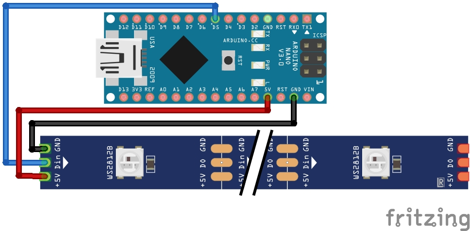

# ChristmasLight

This project is inspired by https://git.fsfe.org/alvar/yh4f-2023-badge.

Ein Projekt des [CoderDojo Potsdam](https://coderdojopotsdam.github.io/) zum gemeinsamen Löten und Basteln in der Adventszeit.

Hier findest du den fertigen Quelltext. Wenn du etwas mehr lernen möchtest, wähle doch eine andere Schwierigkeitsstufe unter "branch" oben aus.

## Materialien

- Arduino Nano oder ähnlicher Microcontroller
- LED Streifen von WS2812B LEDs
- Acrylglas (mögliche Vorlage zum Lasercutten in `schlitten.svg`)
- Holz für die Halterung (mögliche Vorlage zum Lasecuttten in `halterung.svg`)
- einige Jumper-Kabel
- USB Kabel, um den Microcontroller ansprechen zu können

### Anleitung zum Zusammenbauen

1. Zunächst baut ihr aus Holz und Acryl die Halterung und das Motiv eures Weihnachtslichtes und .
1. Falls noch nicht geschehen, lötet ihr drei Jumper-Kabel an euren LED-Streifen
1. Anschließend verbindet ihr `GND` und `5V` jeweils mit den Anschlüssen an eurem Arduino. Den mittleren Datenkanal verbindet ihr mit dem digitalen Pin `5`.

 
Zeichnung erstellt mit [fritzing](https://fritzing.org/) von [Alvar Penning](https://git.fsfe.org/alvar/yh4f-2023-badge/src/branch/main/contrib/sketch.jpg)

### Anleitung für die Software

1. Die Software ist das einfache Beispiel der [Adafruit Neopixel](https://github.com/adafruit/Adafruit_NeoPixel#simple) Bibliothek. Binde diese zunächst wie in der Readme beschrieben in deine Arduino IDE ein.
1. Nun kannst du das Beispiel öffnen und die Anzahl der LED an deine Anzahl LED anpassen.
1. Kannst du die LED auch anders leuchten lassen?

